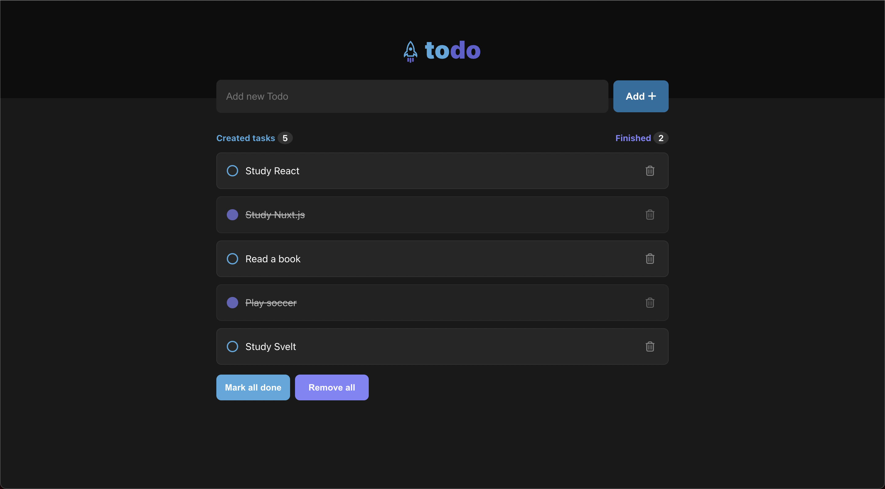

# todo 📝
<p align="center" t>
  
</p>

Manage your todos by using this application made with Vue.js

# Tecnologies 🚀
Vue.js 🚀 <br />
Typescript 🦕

# Result 🤓
<p align="center" t>
  
</p>

# How to get this repository? 🤔
```bash
1. Clone this repository.
2. Run the yarn command at the root of the cloned project folder to download the dependencies.
3. Run yarn dev at the root of the project folder to start the application in development mode.
4. Open the application at localhost:3000. 🚀
```

# How to contribute? 😍
**Fork this repository**
```bash
# Clone your fork
$ git clone your-fork-url && cd vue-list

# Create a branch with your feature or bug fix
$ git checkout -b my-branch

# Commit your changes
$ git commit -m 'my changes'

# Push your branch
$ git push origin my-branch
```

Delete your branch, if you want, when your pull request merge. <br />

Made with 💜 by <a href="https://www.linkedin.com/in/andrecampll/" target="_blank"> andrecampll </a>. <br />
<br />
